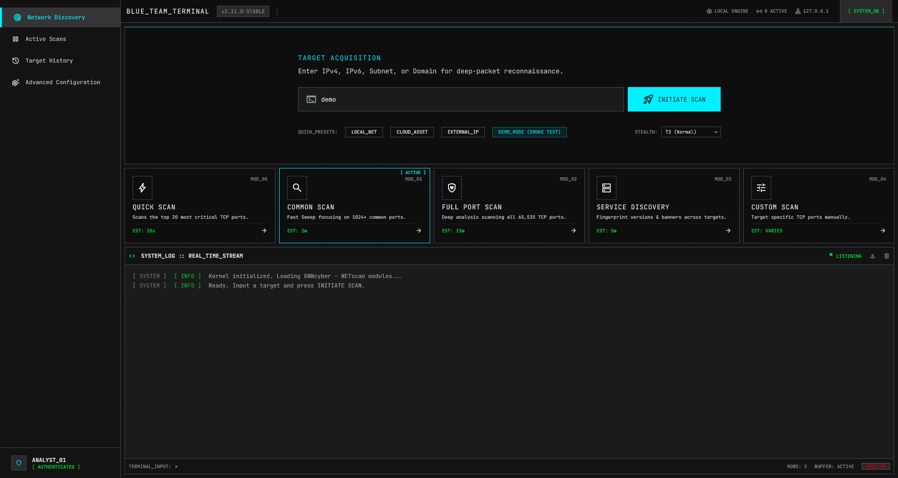
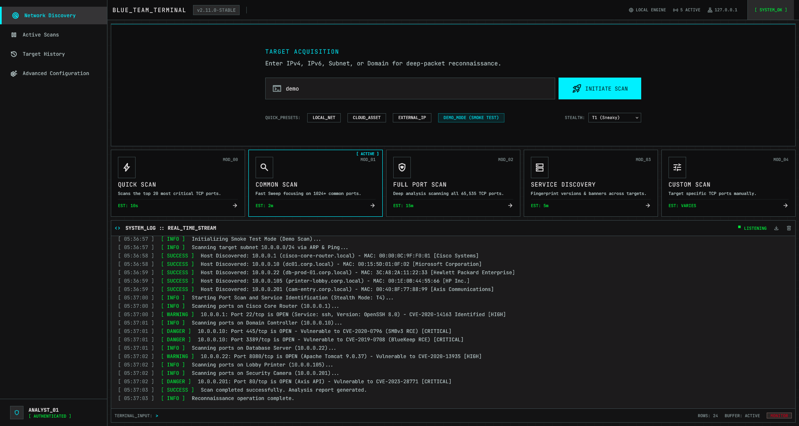
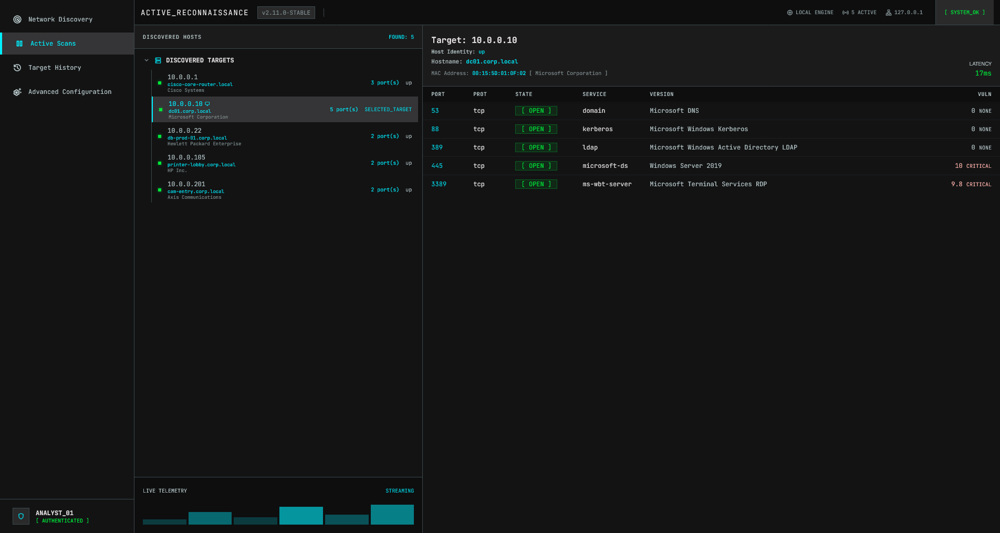
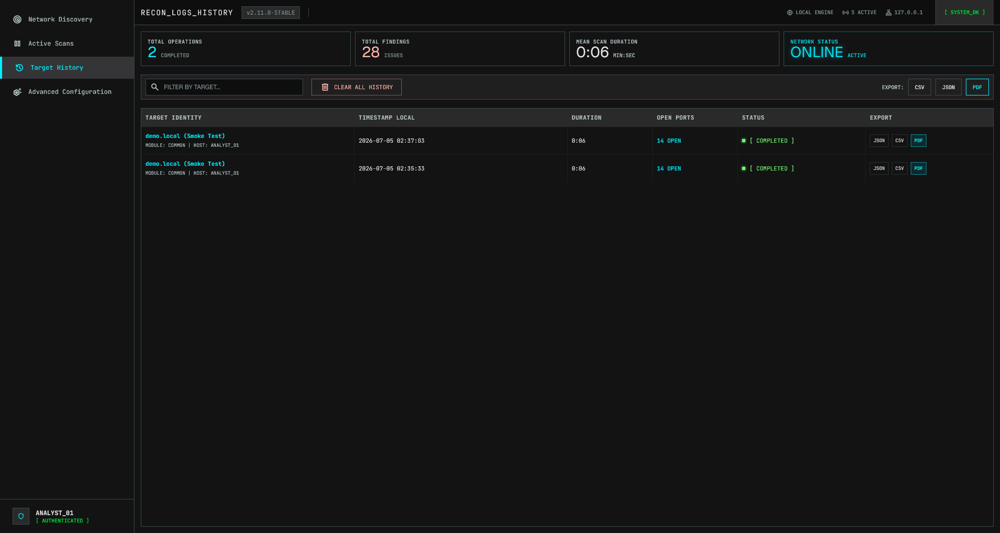
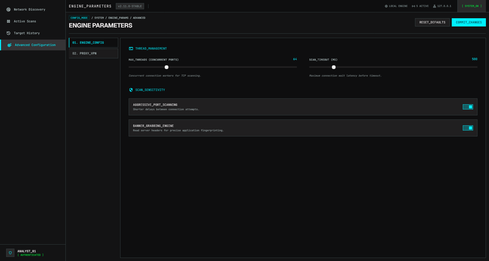
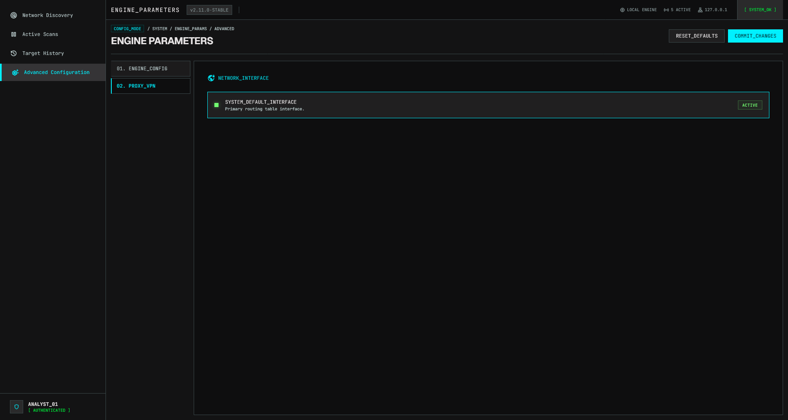

  <h1>GNNscan   Advanced Network Discovery & Vulnerability Scanner</h1>
   
  <video src="https://github.com/BigDesigner/GNNscan/raw/main/media/screenrecord-1.mp4" width="100%" controls autoplay muted loop></video>

 

## 📸 Screenshots / Ekran Görüntüleri

<table>
  <tr>
    <td width="50%">
<strong>Network Discovery / Cihaz Keşfi</strong>
</td>
    <td width="50%">
<strong>Real-time Terminal Logs / Gerçek Zamanlı Loglar</strong>
</td>
  </tr>
  <tr>
    <td width="50%">
<strong>Host Details & Services / Detay Paneli</strong>
</td>
    <td width="50%">
<strong>Target History / Tarama Geçmişi</strong>
</td>
  </tr>
  <tr>
    <td width="50%">
<strong>Engine Parameters / Motor Konfigürasyonu</strong>
</td>
    <td width="50%">
<strong>PDF & CSV Export / Rapor Çıktıları</strong>
</td>
  </tr>
</table>

 

<h2>🇬🇧 English</h2>

GNNscan is a next-generation network discovery tool designed for cybersecurity experts, Blue/Red Team operators, and system administrators. Going beyond traditional network scanners, it provides <strong>completely local, stealthy, and deep</strong> network analysis.

## 🎯 Why GNNscan?
Standard ping and ARP-based network scanners often produce superficial results. GNNscan doesn't just find IP and MAC addresses on your network; it also detects **operating systems, exact service versions, vulnerability levels, and real machine names (Hostnames)**. It does all this while using **Stealth** algorithms to evade detection by firewalls and IDSs.

## 🚀 Key Features (What Sets Us Apart)

### 1. Deep Network & Identity Discovery
- **DNS & mDNS Hostname Resolution:** Instantly identifies real device names on the network (e.g., `iPhone.local`, `MSI-4060.home`).
- **Advanced OS Fingerprinting:** Accurately determines operating systems (Windows, Linux/macOS, Network/Cisco) via TTL (Time-To-Live) values and port characteristics.
- **Smart MAC & Local Interface Analysis:** Bypasses the ARP table to discover the scanning machine's MAC address by reading native network interfaces independent of OS language.
- **Vendor/OUI Detection:** Instantly analyzes device manufacturers.

### 2. Real Service Detection & Banner Grabbing
- **Banner Grabbing:** Sends custom payloads over sockets to open ports to pull the exact service and version running (e.g., `SSH-2.0-OpenSSH`, `HTTP/1.1 200 OK`).

### 3. IDS/IPS Evasion (Stealth Scanning)
- **T1 to T5 Speed Control:** Ranging from T1 (Sneaky) for slow, unsuspicious scans, to T5 (Insane) to scan an entire network in seconds.
- **Shuffled IP Scanning:** Scans IP addresses in a randomized order rather than sequentially to avoid triggering Port Sweep alarms.

### 4. Offline (Air-gapped) Vulnerability Analysis (CVE)
- Correlates open ports, services, and OS versions to score potential vulnerabilities (LOW, MEDIUM, HIGH, CRITICAL).
- Operates **entirely offline** without sending data to the cloud, making it perfect for air-gapped networks.

### 5. Zero External Dependencies & Modern Architecture
- Tailored for "Blue Team" operations with an elegant, modern, dark-themed UI.
- All styles and icons are bundled internally.
- Retains scan history permanently using a local SQLite database with XSS-sanitized interfaces.

---

## 💻 Tech Stack
- **Core (Engine):** Dart
- **Frontend / UI:** HTML5, Vanilla JavaScript, Local Tailwind CSS, Material Symbols
- **Database:** SQLite
- **Bridge:** Flutter InAppWebView (Fully Asynchronous)

## ⚖️ Disclaimer
This tool is developed for authorized personnel to use during penetration testing, network audits, and defense (Blue Team) operations. Only use on networks where you have explicit permission.

<h2>🇹🇷 Türkçe</h2>

Siber güvenlik uzmanları, Blue/Red Team operasyonları ve sistem yöneticileri için tasarlanmış, geleneksel ağ tarayıcılarının ötesine geçerek <strong>tamamen yerel, gizli ve derinlemesine</strong> ağ analizi yapan yeni nesil bir araçtır.

## 🎯 Neden GNNscan?
Standart ping ve ARP tabanlı ağ tarayıcıları genellikle yüzeysel sonuçlar üretir. GNNscan ise ağınızdaki cihazların sadece IP'sini ve MAC adresini bulmakla kalmaz; o cihazın **işletim sistemini, üzerindeki servislerin tam versiyonunu, zafiyet seviyesini ve gerçek makine ismini (Hostname)** de tespit eder. Tüm bu işlemleri yaparken güvenlik duvarlarına yakalanmamak için **Stealth (Gizlilik)** algoritmaları kullanır.

## 🚀 Öne Çıkan Özellikler (Geleneksel Araçlardan Farkımız)

### 1. Derinlemesine Ağ ve Kimlik Keşfi
- **DNS & mDNS Hostname Çözümleme:** Sadece IP adreslerini değil, cihazların ağdaki gerçek isimlerini (ör. `iPhone.local`, `MSI-4060.home`) anında tespit eder.
- **İleri Seviye OS Fingerprinting:** Cihazların işletim sistemlerini (Windows, Linux/macOS, Network/Cisco) TTL (Time-To-Live) değerleri ve port karakteristikleri üzerinden kesin bir şekilde saptar.
- **Akıllı MAC & Yerel Arayüz Analizi:** Taramayı yapan yerel bilgisayarın MAC adresini tespit etmek için ARP tablosunu atlayıp işletim sisteminin native ağ arayüzlerini (`ipconfig /all`, `ifconfig`) Türkçe/İngilizce dil bağımsız olarak okur ve çözer.
- **Vendor/OUI Tespiti:** Cihazların hangi üreticiye ait olduğunu anında analiz eder.

### 2. Gerçek Servis Tespiti ve Banner Grabbing
- Klasik araçlar gibi 80 portunu görünce "HTTP" yazıp geçmez.
- **Banner Grabbing:** Açık portlara soket üzerinden özel payloadlar göndererek o portta gerçekten hangi servisin ve versiyonun (`SSH-2.0-OpenSSH`, `HTTP/1.1 200 OK`, `220 Welcome to FTP Server`) çalıştığını çeker.

### 3. IDS/IPS Atlatma ve Gizlilik (Stealth Scanning)
- Kurumsal ağlardaki Saldırı Tespit Sistemlerine (IDS/IPS) yakalanmamak için tasarlanmıştır.
- **T1'den T5'e Kadar Hız Kontrolü:** T1 (Sneaky) ile çok yavaş ve şüphe çekmeyen taramalar yapabilir veya T5 (Insane) ile saniyeler içinde koca bir ağı tarayabilirsiniz.
- **Shuffled (Rastgele) IP Tarama:** IP adreslerini `1, 2, 3...` diye sırayla taramak yerine karıştırarak (Shuffle) rastgele sırayla tarar. Bu sayede Port sweep alarmlarını tetiklemez.

### 4. Çevrimdışı (Air-gapped) Zafiyet Analizi (CVE)
- Bulunan açık portları, servisleri ve işletim sistemi versiyonlarını eşleştirerek potansiyel zafiyetleri (LOW, MEDIUM, HIGH, CRITICAL) olarak skorlar.
- Bunu yaparken verilerinizi buluta göndermez; **tamamen offline** çalışacak şekilde izole ağlarda kullanılabilir.

### 5. Sıfır Dışa Bağımlılık & Modern Mimari
- Tüm stil (Tailwind CSS) ve ikon kütüphaneleri projenin içine gömülüdür (Air-gapped ortamlarda tam fonksiyonel çalışır).
- Çirkin arayüzlerin aksine, asenkron iletişim kuran (Dart backend <-> Javascript frontend) **şık, modern ve koyu tema (Blue Team)** odaklı bir arayüze sahiptir.
- SQL veri tabanı ile tarama geçmişinizi kalıcı olarak tutar. XSS zafiyetlerine karşı arayüzü sanitize edilmiştir.

---

## 💻 Teknoloji Yığını
- **Core (Engine):** Dart
- **Frontend / UI:** HTML5, Vanilla JavaScript, Local Tailwind CSS, Material Symbols
- **Database:** SQLite
- **Bridge:** Flutter InAppWebView (Tamamen Asenkron)

## ⚖️ Yasal Uyarı
Bu araç, sızma testleri (penetrasyon), ağ denetimleri ve savunma (Blue Team) operasyonları sırasında yetkili personelin kullanması için geliştirilmiştir. Sadece izniniz olan ağlarda kullanınız.

 

> *Copyright © 2024-2026 BigDesigner*
