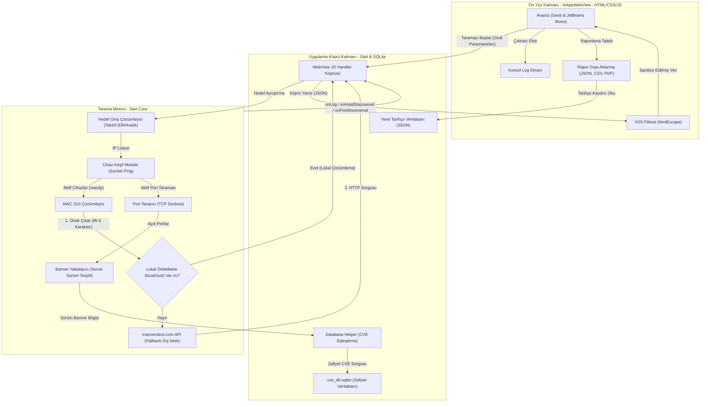

# GNNscan Mimari ve Veri Akış Diyagramı (v2.11.1)

Bu belgede GNNscan uygulamasının **Ön Yüz (Webview)**, **Dart Köprüsü (Bridge)** ve **Tarama Motoru (Core Scan Engine)** bileşenleri arasındaki veri akışları ile mimari katmanları görselleştirilmiştir.

---

## 📊 Mimari Blok Diyagramı

---

## 🔒 Kritik Güvenlik ve Akış Kontrol Noktaları

1.  **XSS Sanitize Geçidi (XSS):** Tarama motorundan veya veri tabanından gelen her türlü dinamik string (IP, Hostname, Port Versiyonu) ön yüze aktarıldıktan sonra DOM'a yazılmadan önce `htmlEscape()` filtresinden geçer.
2.  **Lokal MAC OUI Önbelleği (OUICache):** Keşfedilen cihazların MAC adresleri dış servislere gönderilmeden önce yerel önbellek haritasında (`localOuis`) aranır. Bu sayede tarama trafiğinin dış ağlara sızması engellenir ve %100 çevrimdışı çalışma sağlanır.
3.  **CVE Sürüm Kontrolü (DBHelper):** Uygulama her güncellendiğinde `cve_db_version.txt` dosyası diskteki sürümle kıyaslanır ve gerekirse güncel SQLite veri tabanı otomatik olarak kopyalanır.
